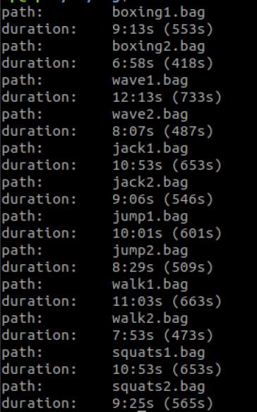

本文件是用于bag文件提取`/ti_mmwave/radar_scan`主题的消息为txt文件

并将消息分为训练集和测试集(最终生成文件夹为`to_txt`)


使用方式

1. 将bag文件放在`bag`文件夹中

2. 创建文件夹`to_txt`

3. 修改class_names中的种类类型, 训练集的比例

4. `python ./rosbag_process.py` 

5. 处理后的文件放在to_txt中，其中文件树为

	```txt
	├── README.md
	├── bag
	│   ├── boxing1.bag
	│   ├── boxing2.bag
	│   ├── jack1.bag
	│   ├── jack2.bag
	│   ├── jump1.bag
	│   ├── jump2.bag
	│   ├── squats1.bag
	│   ├── squats2.bag
	│   ├── walk1.bag
	│   ├── walk2.bag
	│   ├── wave1.bag
	│   └── wave2.bag
	├── info.sh
	├── info.png
	├── rosbag_process.py
	└── to_txt
		├── test
		│   ├── boxing.txt
		│   ├── jack.txt
		│   ├── jump.txt
		│   ├── squats.txt
		│   ├── walk.txt
		│   └── wave.txt
		└── train
			├── boxing.txt
			├── jack.txt
			├── jump.txt
			├── squats.txt
			├── walk.txt
			└── wave.txt
	```

	
	
这里分开后的txt文件还需要经过滑动窗口处理!

详细见`slide_process`文件夹(这里是为了也能够处理`radhar`数据集所以这样设计)


我们总共采集了114分钟的数据, 相对于`radhar数据集`我们新增了`挥手动作`

- **拳击(17分钟)**
- **挥手(20分钟)**
- **开合跳(20分钟)**
- **上下跳(18分钟)**
- **行走(19分钟)**
- **下蹲(20分钟)**


 


## 使用方法

1. 首先你需要搭建[ROS环境](https://willpower.blog.csdn.net/article/details/124235487)
2. 
	`pip install --extra-index-url https://rospypi.github.io/simple/ rosbag`

	`pip insatall sklearn`

3. `python3 ./rosbag_process.py`
